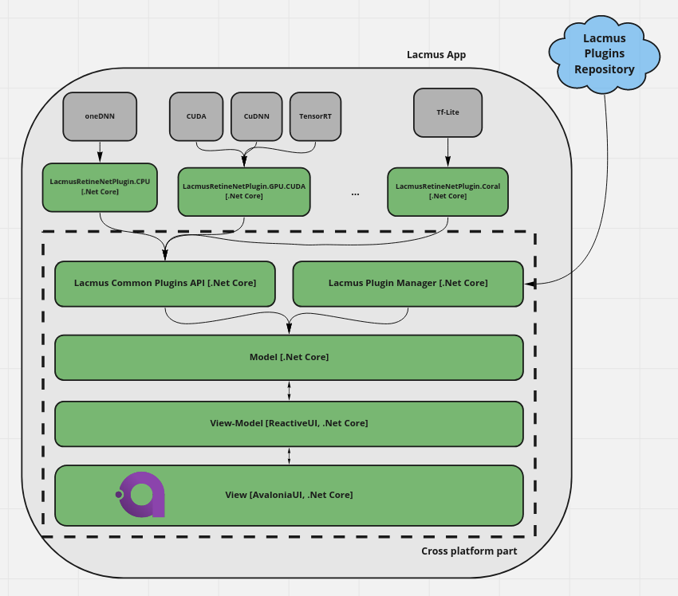

# Lacmus Application

Cross-platform application that searches for lost people in the forest using object detection neural networks. The application runs on Linux, Windows and Mac OS X. Lacmus application written in C#, .NET Core, [ReactiveUI](https://github.com/reactiveui/ReactiveUI) and [Avalonia](https://github.com/AvaloniaUI/Avalonia) and use Tensorflow / ONNX for inference deep learning Models.

## Main view


## Docs

You can find more documentation here: [Rus](https://docs.lacmus.tech/v/russian) [Eng](https://docs.lacmus.tech)

### System requirements and supported platforms

- `Windows 7 SP1 or higher (64 bit)` - supports **CPU** and **GPU** (Cuda, DirectML) ml inference.
- `Linux (64 bit)` - supports **CPU**, **GPU** (Cuda, ROCm) and **Coral Edge TPU** ml inference.
- `MacOS 11 or higher (64 bit)`  - supports **CPU** ml inference.

- Minimum 2x CPU cores and 4 GB of RAM for ML inference.

### Brief description of architecture
*Architecture diagram*


Application use [LacmusPlugins](https://github.com/lacmus-foundation/lacmus-plugins) for ML model inference and [PluginReposiroty web API](https://github.com/lacmus-foundation/lacmus-plugins-repository) for hosting ML models.

## Building from source

```bash
$ git clone https://github.com/lacmus-foundation/lacmus-app.git
$ cd lacmus-app/src
$ dotnet restore
$ dotnet run --project LacmusApp.Avalonia
```

### Contributing
Contributors are welcome! You can contact me (gosha20777@live.ru) to get more info.