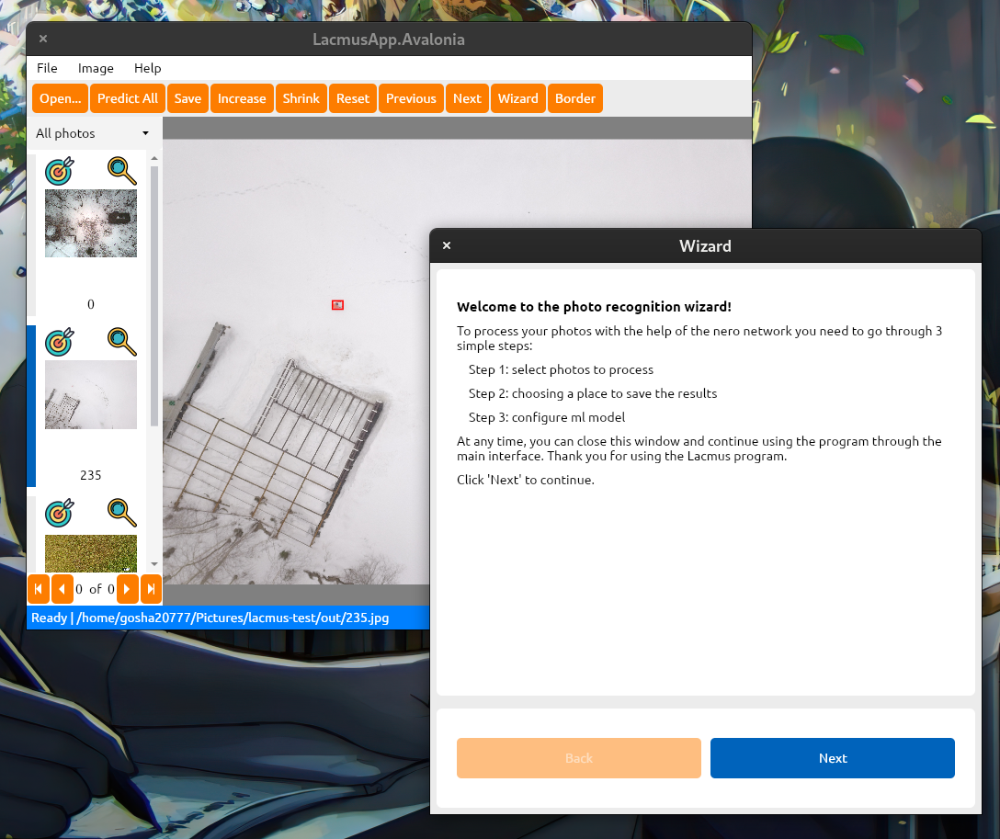

# lacmus application

Cross-platform client for the [Lacmus neural network](https://github.com/lacmus-foundation/lacmus) that searches for lost people in the forest using [RetinaNet](https://arxiv.org/abs/1708.02002) object detection. The application runs on Linux, Windows and Mac OS X. The client written in C#, .NET Core, [ReactiveUI](https://github.com/reactiveui/ReactiveUI) and [Avalonia](https://github.com/AvaloniaUI/Avalonia) and use [Docker](https://www.docker.com/) with [Docker.DotNet](Docker.DotNet) to deep learning inference.

### Main view



### System requirements and supported platforms

- `Windows 7 SP1 or higher (64 bit)` - supports **CPU** ml inference.
- `Linux (64 bit)` - supports **CPU**, **GPU** and **Coral Edge TPU** ml inference (recommended).
- `MacOS 11 or higher (64 bit)`  - supports **CPU** and **Coral Edge TPU** ml inference.

- Minimum 2x CPU cores and 4 GB of RAM for ML inference.

You can find detailed information about system requirements and operating speed on various devices from [lacmus wiki](https://github.com/lacmus-foundation/lacmus/wiki/%D0%94%D0%BB%D1%8F-%D0%BF%D0%BE%D0%BB%D1%8C%D0%B7%D0%BE%D0%B2%D0%B0%D1%82%D0%B5%D0%BB%D0%B5%D0%B9:-%D1%81%D0%B8%D1%81%D1%82%D0%B5%D0%BC%D0%BD%D1%8B%D0%B5-%D1%82%D1%80%D0%B5%D0%B1%D0%BE%D0%B2%D0%B0%D0%BD%D0%B8%D1%8F) *(Russian language)*

### Brief description of architecture and work pipeline
*Architecture diagram*


The entire machine learning stack with drivers and necessary libraries is hidden in a drker image. The application using the client docker manages images with containers, downloads them, installs and removes them if necessary. All machine learning models are located in the docker repository and are available for download.

The user is free to add other repositories he needs to use other machine learning models.

You can learn more about the application architecture and api in [lacmus wik](https://github.com/lacmus-foundation/lacmus/wiki/%D0%94%D0%BB%D1%8F-%D1%80%D0%B0%D0%B7%D1%80%D0%B0%D0%B1%D0%BE%D1%82%D1%87%D0%B8%D0%BA%D0%BE%D0%B2:-Desktop-%D0%BF%D1%80%D0%B8%D0%BB%D0%BE%D0%B6%D0%B5%D0%BD%D0%B8%D0%B5) (Russian language).

## Building from source

The easiest way to get the application is [dowmload latest release](https://github.com/lacmus-foundation/lacmus-app/releases).

For more info, user guide and installation guide look at [lacmus wiki](https://github.com/lacmus-foundation/lacmus/wiki).

### 1. Install Dependencies
- Git: https://git-scm.com/downloads
- .Net Core 3.1: https://dotnet.microsoft.com/download/dotnet-core/3.1
- Docker: https://docs.docker.com/install/
- Nvidia-docker2 (if you have nVidia CUDA compartable GPU and want make GPU inference): https://github.com/nvidia/nvidia-docker/wiki/Installation-(version-2.0)

### 2. Get the code, build and run the project

```bash
$ git clone https://github.com/lacmus-foundation/lacmus-app.git
$ cd lacmus-app
$ dotnet restore
```

build in debug mode
```bash
$ dotnet build
$ dotnet run --framework netcoreapp3.1
```
or create self executable binary file
```bash
# Build for linux
$ dotnet publish --framework netcoreapp3.1 --runtime="linux-x64" -c Release -o ./bin/app/linux

# Build for windows
$ dotnet publish --framework netcoreapp3.1 --runtime="win-x64" -c Release -o ./bin/app/win10

# Build for Mac OS X
$ dotnet publish --framework netcoreapp3.1 --runtime="osx-x64" -c Release -o ./bin/app/osx
```

### Contributing
Contributors are welcome! You can contact me (gosha20777@live.ru) to get more info.